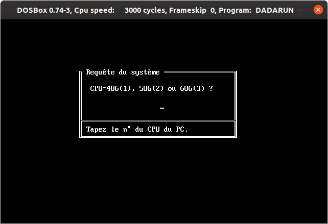
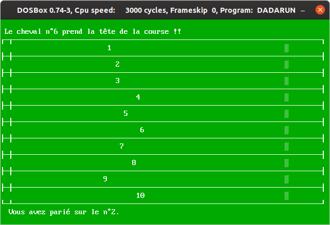
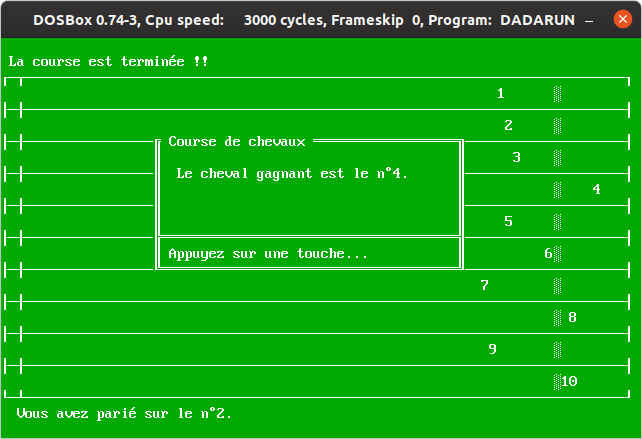

# Dadarun

The 1st MSDOS game I ever programmed back in 1999 using Pascal. It was a school project, a part of the studies leading to me getting an Associate Degree in Computer Network Administration.
The original README file credits *TME Software & MORTAL Design Inc.*, because I didn't work on this alone: Sebastien Mortal, a school friend, contributed to this game.

# Presentation
## What this game is about
*Dadarun* is a horse race betting game.

## Language
The game is in French, but is compatible with your regular QWERTY keyboard.

## Graphics (text mode)

# How to run the game
Dosbox is probably the best option to safely experience *Dadarun*, a blast from '99.
You will be asked for *IDCode* at the start of the game, just input *1980* (my birthdate).

# Free Pascal issues
## Can't find unit system

Add the path to the units folder in Options | Directories | Units 
In my case, it is `/usr/lib/x86_64-linux-gnu/fpc/3.2.2/units/x86_64-linux/`
